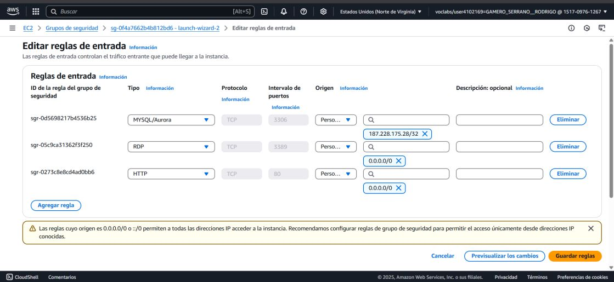
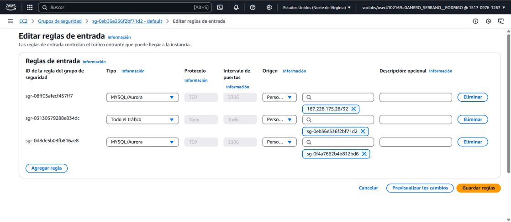
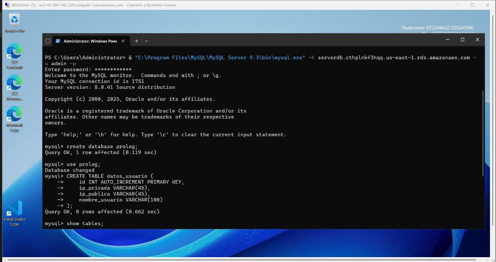
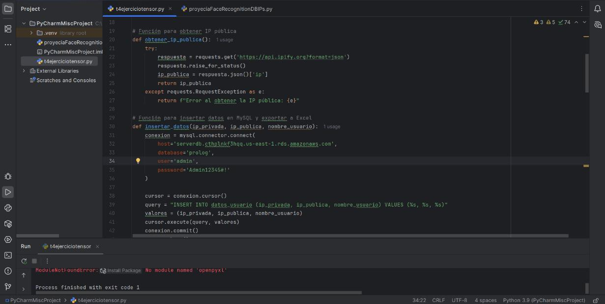
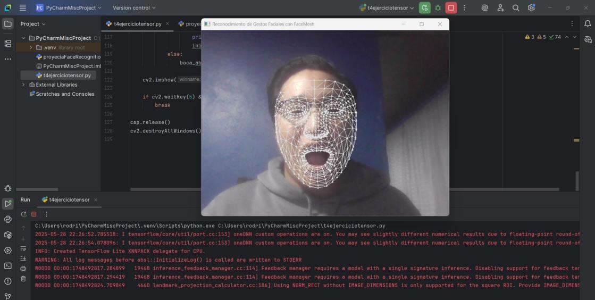
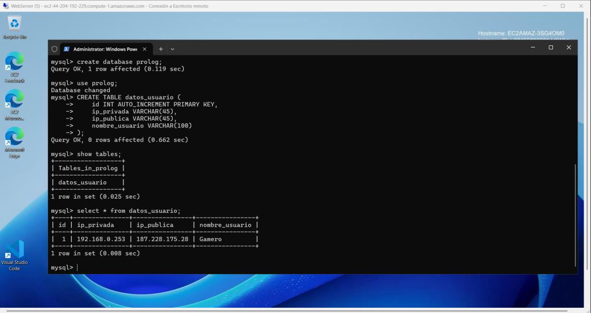

# Proyecto final - PLF
---
### Reconocimiento Facial con TensorFlow e Inserción en MySQL
---

## Autores

- **Gamero Serrano Rodrigo** – N.C. 21200597  
- **Feria Vázquez Martín** – N.C. 21200594  

## Curso

**Programación Lógica y Funcional**  
**Profesora:** Mtra. Tania Ofelia López Zerón  
**Fecha de entrega:** 29 de mayo de 2025  

---

## Objetivo

Realizar una práctica funcional que combine el uso de **TensorFlow para reconocimiento facial**, obtención de IPs del sistema, y la **inserción de datos en una base de datos MySQL** desde una aplicación hospedada en un servidor.

---

## Requisitos

- Analizar el código anexo con reconocimiento facial en TensorFlow.
- Implementar una conexión a **MySQL**.
- Crear una función que inserte los datos en la siguiente tabla:

```sql
insertar_datos(ip_privada, ip_publica, nombre_usuario)
```

---

## Configuración de reglas de grupo de seguridad en la instancia

Se configuraron las reglas de **HTTP** y **MySQL** para optimizar la conexión con la base de datos.



---

## Configuración de reglas de grupo de seguridad en la base de datos

Se configuraron 2 reglas de **MySQL**: una para distinguir la IP del equipo físico y otra para reconocer el grupo de reglas de seguridad de la instancia.



---

## Creación de base de datos desde la instancia

Desde la consola de comandos (cmd), accedimos a MySQL en la instancia, creamos la base de datos llamada `porlog` y la tabla `datos_usuario` donde se almacenarán los datos enviados desde el programa en Python.



---

## Modificación de parámetros en el código

Se cambiaron los parámetros necesarios para conectar correctamente con la base de datos.



---

## Ejecución del código

Se ejecutó el programa en Python que realiza el registro de los datos en la base de datos.



---

## Revisión de resultados

Desde la instancia, se validó que los datos fueron correctamente almacenados en la base de datos.



---

## Conclusiones

**Feria Vázquez Martín – N.C. 21200594**  
> La inteligencia artificial (IA) es ya una realidad en todos los sectores. [...] Para que la IA sea positiva, se deben fomentar marcos éticos, capacitar trabajadores y garantizar supervisión humana.

**Gamero Serrano Rodrigo – N.C. 21200597**  
> La IA ha demostrado eficacia en resolver problemas, pero también enfrenta desafíos éticos. [...] La clave será un desarrollo ético, humano y transparente.

---

## Referencias

- Sebesta, R. W. (2018). *Concepts of programming languages* (12ª ed.). Pearson.  
  [https://www.pearson.com/...](https://www.pearson.com/en-us/subject-catalog/p/concepts-of-programming-languages/P200000003549/9780134997186)
- Aho, A. V., & Ullman, J. D. (1995). *Foundations of computer science*. Freeman.  
  [https://infolab.stanford.edu/~ullman/focs.html](https://infolab.stanford.edu/~ullman/focs.html)
- [Python documentation](https://docs.python.org/3/)
- [Java documentation](https://docs.oracle.com/en/java/)
- [C++ reference](https://cplusplus.com/)
- [SQL tutorial - W3Schools](https://www.w3schools.com/sql/)
